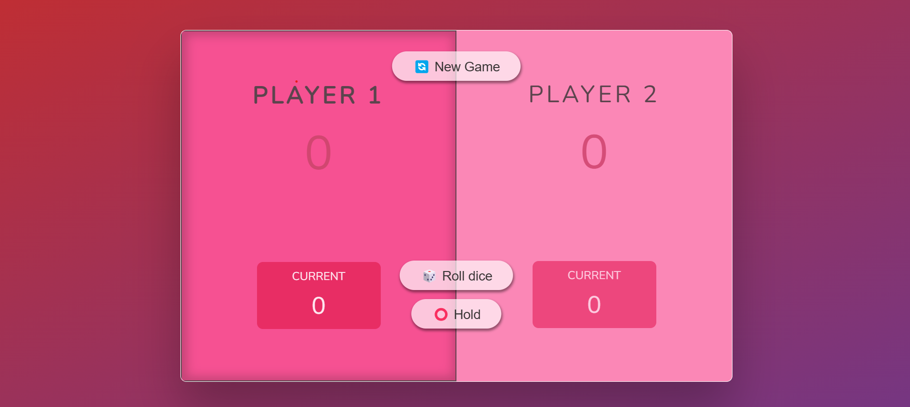

# 🎲 Roll Dice Game

A fun and interactive dice-rolling game built using **HTML**, **CSS**, and **JavaScript**. In this two-player game, players take turns rolling a dice, accumulating points, and competing to reach a score of **100** to win the game.

---

## 🕹️ How to Play
1. **Players**: The game supports two players.
2. **Gameplay**:
   - On their turn, a player rolls the dice to get a score between 1 and 6.
   - The player can either:
     - **"Hold"**: Add the current round score to their total score and pass the turn.
     - **"Roll Again"**: Continue rolling the dice to increase their round score.
   - If the player rolls a **1**, they lose their current round score, and their turn ends immediately.
3. **Winning the Game**: The first player to reach **100 points** wins!

---

## 🎨 Features
- Smooth and responsive UI designed with **HTML** and **CSS**.
- Dynamic and interactive gameplay powered by **JavaScript**.
- Real-time score updates and turn indicators.
- Reset option to restart the game anytime.

---

## 🛠️ Technologies Used
- **HTML**: Structure and layout of the game.
- **CSS**: Styling for a visually appealing interface.
- **JavaScript**: Game logic and interactivity.

---

## 🚀 Getting Started
1. Clone the repository:
   ```bash
   https://rahulrajsharma1351.github.io/Roll-Dice/

📸 Desktop Design


🙌 Acknowledgments
Inspired by classic dice-rolling games.
Special thanks to Rahul raj sharma for developing this project.

📧 Contact
For any queries or feedback, feel free to reach out:

Email: rahulrajsharma512@gmail.com
GitHub: [rahulrajsharma1351](https://github.com/rahulrajsharma1351)

